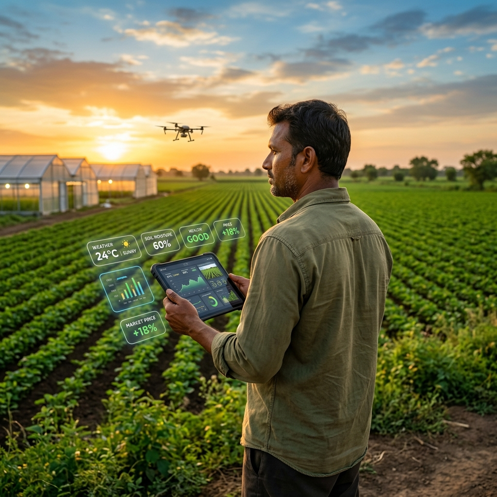

<div align="center">
  
  

  # 🌱 AgroWeb
  **India's First Farm-to-Market Intelligence Platform**

  [](https://reactjs.org/)
  [](https://vitejs.dev/)
  [](https://tailwindcss.com/)
  [](https://sih.gov.in/)

</div>

<br />

## 💡 The Problem
In the traditional agricultural supply chain, Indian farmers lose up to **40-50% of their potential profit** to middlemen, commission agents, and cold-storage losses. On the flip side, consumers pay high retail markups for produce that is days old by the time it reaches supermarkets. Furthermore, farmers lack real-time, actionable intelligence to combat pests and unpredictable weather.

## 🚀 The Solution: AgroWeb
AgroWeb is not just another e-commerce clone. It is a dual-engine platform combining **AI-driven agricultural intelligence** with a **zero-commission direct marketplace**. 

We empower farmers to grow smarter crops using AI, and then give them the digital infrastructure to sell that harvest directly to consumers and businesses.

### 🌟 Why AgroWeb is Different
Most AgTech platforms do one of two things: they either give weather advice OR they act as a marketplace. **AgroWeb does both, seamlessly.**
- **Farmer-First Economics:** By eliminating the mandi (wholesale market) intermediaries, farmers increase their profit margins significantly while buyers pay less.
- **AgroScan AI Built-In:** We don't expect farmers to know every disease. They just upload a photo of a sick crop, and our AI diagnoses it and suggests organic & chemical treatments.
- **Predictive Yield & Pricing:** The AI Crop Advisor analyzes local soil, season, and water data to recommend the most profitable crops to plant, cross-referencing with live MSP (Minimum Support Price) data.

---

## ✨ Core Features

### 👨‍🌾 For Farmers
* **AgroScan Pest Detection:** Upload photos of infected leaves for instant AI diagnosis and step-by-step treatment plans.
* **AI Crop Advisor:** ML-based recommendations on what to plant next based on hyper-local parameters.
* **Hyper-Local Weather:** 5-day forecasts tailored specifically to farm coordinates, including soil moisture and UV index.
* **Smart Dashboard:** Track active listings, monthly revenue, pending orders, and logistics—all from a mobile-first interface.

### 🛒 For Buyers
* **Direct Sourcing:** Buy authentic, premium, and GI-tagged produce (e.g., Alphonso Mangoes, Guntur Chilli) straight from the source.
* **Farm Traceability:** Know exactly which farm your food came from and read real farmer profiles and reviews.
* **Wholesale or Retail:** Buy 1kg for your kitchen or 100kg for your restaurant.

---

## 💻 Tech Stack
- **Frontend Framework:** React (Vite)
- **Styling:** Tailwind CSS (Custom glassmorphism UI, fluid animations)
- **Icons & Assets:** Lucide React, Unsplash (Curated high-res imagery)
- **Routing:** React Router v6
- **State Management:** React Context API

---

## 🛠️ Local Setup

1. **Clone the repository:**
   ```bash
   git clone https://github.com/Mr-spiky/agroweb.git
   cd agroweb
   ```

2. **Install dependencies:**
   ```bash
   npm install
   ```

3. **Start the development server:**
   ```bash
   npm run dev
   ```
   Open `http://localhost:3000` to view it in your browser.

---

## 🔑 Demo Access
You can test the application without registering using the built-in demo accounts:

**Farmer Demo:**
* Email: `farmer@demo.com`
* Password: `demo123`

**Buyer Demo:**
* Email: `buyer@demo.com`
* Password: `demo123`

---

<div align="center">
  <i>Built with ❤️ for the SIH Hackathon. Empowering the hands that feed the nation.</i>
</div>
